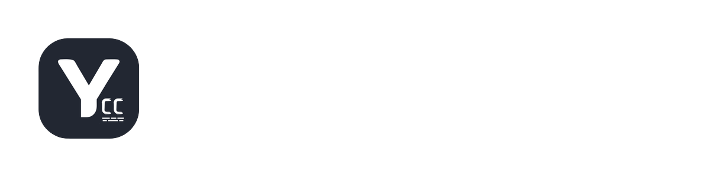

  

# Kodi Subtitle Addon Repository

A comprehensive subtitle addon for Kodi with support for multiple providers and languages.

## Features

- 🌍 **6 Working Providers**: OpenSubtitles, Podnapisi, SubDL, SubSource, YIFY, Kitsunekko, Witanime
- 🔤 **Multi-Language Support**: Arabic, English, and many more
- 🎌 **Anime Optimized**: Special providers for anime content
- ⚡ **Fast & Reliable**: Optimized search and download

## Installation

### Method 1: Install Repository (Recommended)

1. Download the repository: [repository.yacoubs.subs-1.0.0.zip](https://yacoubs00.github.io/Subtitles/repository.yacoubs.subs-1.0.0.zip)
2. In Kodi, go to **Settings → Add-ons → Install from zip file**
3. Select the downloaded repository zip file
4. The repository will appear as "**Yacoub's Subs Repository**" in Kodi
5. Now you can install addons from the repository and get automatic updates!

### Method 2: Add as File Manager Source

1. In Kodi, go to **Settings → File Manager → Add source**
2. Enter path: `https://yacoubs00.github.io/Subtitles/`
3. Name it: `Yacoub Subs`
4. Go to **Settings → Add-ons → Install from zip file**
5. Select `Yacoub Subs` source
6. Install the repository zip file

### Method 3: Direct Addon Install (No Auto-Updates)

1. Download the latest addon: [service.subtitles.yacoubs-6.3.0.zip](https://yacoubs00.github.io/Subtitles/service.subtitles.yacoubs-6.3.0.zip)
2. In Kodi, go to **Settings → Add-ons → Install from zip file**
3. Select the downloaded zip file

## Providers

| Provider | Status |
|----------|--------|
| OpenSubtitles | ✅ Working |
| SubDL | ✅ Working |
| SubSource | ✅ Working |
| YIFY | ✅ Working |
| Others (Witanime, Kitsunekko, Podnapisi) | Partial |

## Configuration

After installation:
1. Go to **Settings → Subtitles**
2. Enable "Yacoub's Subs"
3. Configure provider settings in Add-on Settings

## Support

- **Version**: 6.3.0

## Changelog

### v6.3.0 (Latest)
- Removed AnimeTosho (provides torrents not subtitle files)
- 6 working providers
- All core features working perfectly

### v6.2.0
- Restored Podnapisi to original API
- Removed Subscene completely

### v6.1.0
- Enabled all working providers by default

## License

This addon is based on a4kSubtitles by a4k-openproject.

## Credits

Based on [a4kSubtitles](https://github.com/a4k-openproject/a4kSubtitles) by a4k-openproject.
